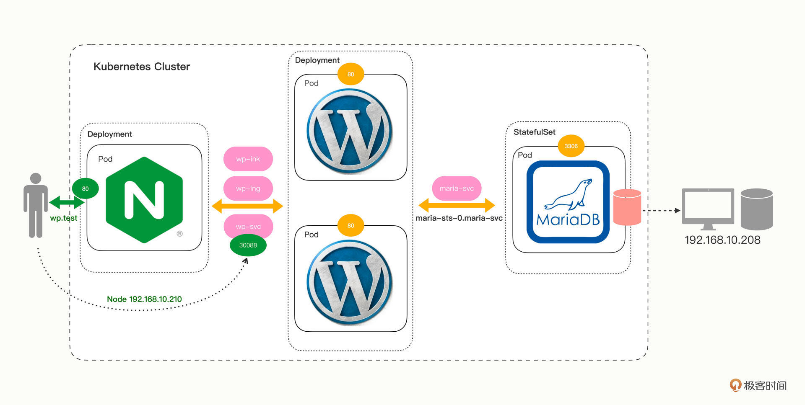

# 运行



## 基本配置
```bash
mkdir -p /tmp/nfs/
kubectl create -f provisioner/
kubectl create -f alldeploy/
```

provisioner: 动态存储卷
kubectl get deployments.apps -n kube-system

alldeploy: 所有脚本
wp-ing.yml  wp-kic.yml  分别部署ingress ingressclass 和 ingresscontroller
wp-maria.yml 部署mariaDB
wp-dep.yml   部署wordpress

